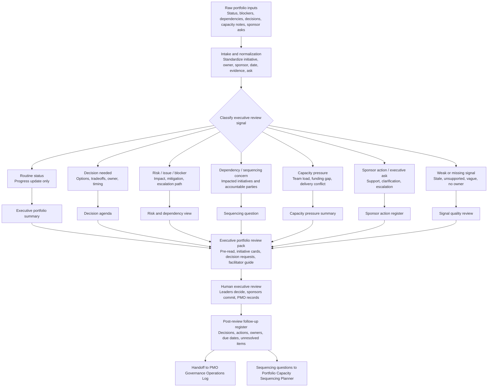

# Executive Portfolio Review Pack Builder

**AI-assisted executive portfolio review operating system for PMO, EPMO, portfolio governance, steering committee preparation, decision agendas, risk/dependency review, capacity pressure summaries, and sponsor follow-through.**

This repository packages a public-safe ChatGPT Project runtime and supporting GitHub examples for turning messy portfolio updates into an executive-ready portfolio review pack.

## Portfolio exhibit

| Review question | Where to look |
|---|---|
| Status | Public portfolio prototype with a ChatGPT Project runtime and a small local sample builder. |
| Best evaluator | PMO, EPMO, portfolio, program, transformation office, Chief of Staff, and executive operations leaders preparing sponsor or steering-committee reviews. |
| Operating decision supported | What should executives review, decide, escalate, sequence, or carry forward after seeing current portfolio signal? |
| Concrete example | [`examples/sample-output.html`](examples/sample-output.html) shows a synthetic executive review pack built from sample portfolio data. |
| Before / after proof | Before: status updates, blockers, risks, capacity notes, and sponsor asks are scattered across inputs. After: the material is organized into an executive summary, decision agenda, risk/dependency view, capacity pressure summary, and follow-up register. |
| Boundary | This module packages the review. It does not approve funding, change priorities, score investments, assign owners, or run delivery. |
| Portfolio lane | [Build executive review packs](https://policani.net/#navigator). |

## One-sentence description

The Executive Portfolio Review Pack Builder helps PMO, EPMO, portfolio, program, and operating leaders convert initiative updates, blockers, decisions, risks, dependencies, capacity constraints, and sponsor asks into a concise executive review pack without giving AI authority over funding, prioritization, sequencing, or risk acceptance.

## Operating problem

Executives usually do not need more status narration. They need a decision-ready portfolio view that answers:

- What is in flight?
- What changed since the last review?
- What is blocked or stalled?
- What decisions are required?
- Where is capacity constrained?
- What risks or dependencies threaten commitments?
- What follow-up must be tracked after the review?

This module exists to separate executive signal from status theater.

## Who this is for

- PMO and EPMO leaders
- Portfolio managers
- Program governance leads
- Chiefs of staff
- Delivery operations leaders
- Transformation office leaders
- Senior program managers preparing executive forums
- AI workflow builders looking for a human-governed PMO operating-system example

## What it does

- Ingests portfolio review inputs from notes, tables, spreadsheets, status summaries, and governance logs.
- Classifies routine status, blockers, decision requests, sponsor asks, weak signals, capacity concerns, and dependencies.
- Produces an executive portfolio summary, decision agenda, initiative cards, tradeoff brief, risk/dependency view, capacity pressure summary, and post-review follow-up register.
- Flags weak evidence, stale green statuses, unclear owners, missing options, and unresolved handoffs.
- Routes decisions, actions, risks, and unresolved items back to PMO Governance Operations Log.
- Routes sequencing questions to Portfolio Capacity Sequencing Planner.

## What it does not do

This project is **not** a PPM platform, financial planning system, resource optimizer, autonomous project manager, or executive decision engine.

It does not approve funding, change priorities, own project plans, replace portfolio scoring, resequence work, accept risk, assign owners, notify stakeholders, or alter live systems.

## Architecture decision

| Question | Decision |
|---|---|
| Operating problem | Executive portfolio reviews need decisions, risks, dependencies, capacity pressure, and follow-through, not more status. |
| Existing adjacent modules | Business Case System, Project Charter Initiation Agent, Portfolio Prioritization Scoring Agent, PMO Governance Operations Log, and Portfolio Capacity Sequencing Planner. |
| What's missing | A pack-building layer that converts governed execution signals into executive review materials. |
| Lifecycle position | After initiatives are captured, scored, chartered, or already in governed execution; before sponsor/executive review. |
| This module owns | Review intake, signal classification, pack construction, decision agenda framing, risk/dependency/capacity views, and follow-up register drafting. |
| Adjacent modules own | Business cases, charters, prioritization/scoring, ongoing governance logging, and detailed sequencing analysis. |
| Accepted inputs | Initiative rosters, status notes, decision candidates, governance logs, dependency lists, capacity notes, sponsor asks, risks, and blockers. |
| Produced outputs | Executive summary, decision agenda, initiative cards, risk/dependency view, capacity pressure summary, tradeoff brief, sponsor action register, and post-review follow-up register. |
| Downstream handoffs | PMO Governance Operations Log receives actions, decisions, risks, unresolved items; Portfolio Capacity Sequencing Planner receives sequencing conflicts and capacity questions. |
| Human-owned decisions | Funding, sequencing, priority changes, scope tradeoffs, risk acceptance, owner changes, and formal commitments. |
| Non-overlap boundary | This module packages the review. It does not score, authorize, charter, sequence, or run delivery. |

## Module boundary

- **This module starts when** initiatives have been captured, scored, chartered, or moved into governed execution.
- **This module ends when** an executive portfolio review pack is ready for sponsor discussion.
- **This module produces** executive summaries, decision requests, portfolio health views, risk/dependency views, capacity pressure summaries, tradeoff briefs, and follow-up registers.
- **This module hands off to** PMO Governance Operations Log and Portfolio Capacity Sequencing Planner.
- **This module does not** approve funding, change priorities, own project plans, replace portfolio scoring, or act as a PPM tool.

## How to use this in ChatGPT

1. Create a new ChatGPT Project.
2. Upload **only the files inside `chatgpt-project/`**.
3. Do **not** upload the whole repository into ChatGPT.
4. Start with `start-here.md`.
5. Paste or upload your portfolio inputs.
6. Ask the project to classify the inputs, build the review pack, or generate a specific artifact.
7. Review all outputs before sharing them with executives or sponsors.

The other folders are for GitHub review, examples, workflow inspection, local testing, and quality review.

## How to use the full repository locally or in Codex

Use the full repository when you want to inspect the examples, run the local sample tool, or modify the package.

```bash
cd executive-portfolio-review-pack-builder
python tools/build_review_pack.py --input examples/sample-data.csv --output examples/sample-output.html --findings-csv examples/findings-log.csv --findings-jsonl examples/findings-log.jsonl
```

The tool uses only Python standard libraries. It does not call external services.

## Adjacent module fit

| Lifecycle question | Module |
|---|---|
| Is the idea worth formal investment review? | Business Case System |
| What are we authorizing and how will it be governed? | Project Charter Initiation Agent |
| What should be prioritized, funded, or constrained? | Portfolio Prioritization Scoring Agent |
| What is happening in governed execution week to week? | PMO Governance Operations Log |
| What should executives review now? | **Executive Portfolio Review Pack Builder** |
| What sequencing or capacity tradeoff needs deeper planning? | Portfolio Capacity Sequencing Planner |

## Workflow



## Folder structure

```text
executive-portfolio-review-pack-builder/
  README.md
  AGENTS.md
  LICENSE.md
  .gitignore
  chatgpt-project/
    start-here.md
    operating-model.md
    trigger-map.md
    portfolio-review-intake.md
    executive-pack-builder.md
    decision-request-rules.md
    risk-dependency-screen.md
    capacity-pressure-screen.md
    output-templates.md
    handoff-rules.md
    working-session-prompts.md
    quality-review-rubric.md
    privacy-human-control.md
    glossary.md
  examples/
    sample-data.html
    sample-data.csv
    sample-prompts.html
    sample-output.html
    findings-log.csv
    findings-log.jsonl
  tools/
    build_review_pack.py
    tool-guide.html
  workflow/
    workflow.mmd
  quality-review/
    package-test-results.html
    senior-pmo-self-critique.html
```

## Runtime file count and constraints

- Runtime folder: `chatgpt-project/`
- Runtime files: 14
- Runtime structure: flat; no subfolders
- Runtime design: self-contained, non-duplicative, and usable without the GitHub example layer
- Configuration: none required
- Live-system access: none

## Primary outputs

- Executive portfolio summary
- Decision agenda
- Initiative review cards
- Risk, blocker, and dependency summary
- Capacity pressure summary
- Tradeoff brief
- Sponsor action register
- Steering committee discussion guide
- Post-review decision and action register
- Signal quality review
- Handoff notes for adjacent modules

## Examples

- `examples/sample-data.html` explains the synthetic scenario.
- `examples/sample-data.csv` contains dummy portfolio inputs for 38 active initiatives and 11 stalled items.
- `examples/sample-prompts.html` shows example ChatGPT working-session prompts.
- `examples/sample-output.html` shows the generated executive review pack.
- `examples/findings-log.csv` and `examples/findings-log.jsonl` show classified findings.

## Human-control statement

This system supports intake, classification, synthesis, drafting, routing, and review. Humans remain accountable for funding, sequencing, priorities, commitments, risk acceptance, approvals, stakeholder communication, and changes to live systems.

## Public-safe data statement

All example data is synthetic. Do not upload employer-private, client-private, financial-private, security-sensitive, regulated, or proprietary material unless you have authority and have applied appropriate privacy controls.

## License

Source code and scripts are licensed under MIT. Documentation, prompts, templates, examples, and other non-code materials are licensed under CC BY 4.0 with attribution to Marco Policani. See `LICENSE.md`.

## Search keywords

PMO, EPMO, portfolio governance, portfolio review, executive portfolio review, steering committee, governance cadence, decision agenda, executive decision support, initiative review, risk review, dependency review, blocker review, capacity planning, sequencing, sponsor action, tradeoff brief, portfolio operating model, AI-assisted PMO, human-in-the-loop, ChatGPT Project, Codex, project portfolio management, governance artifacts.
